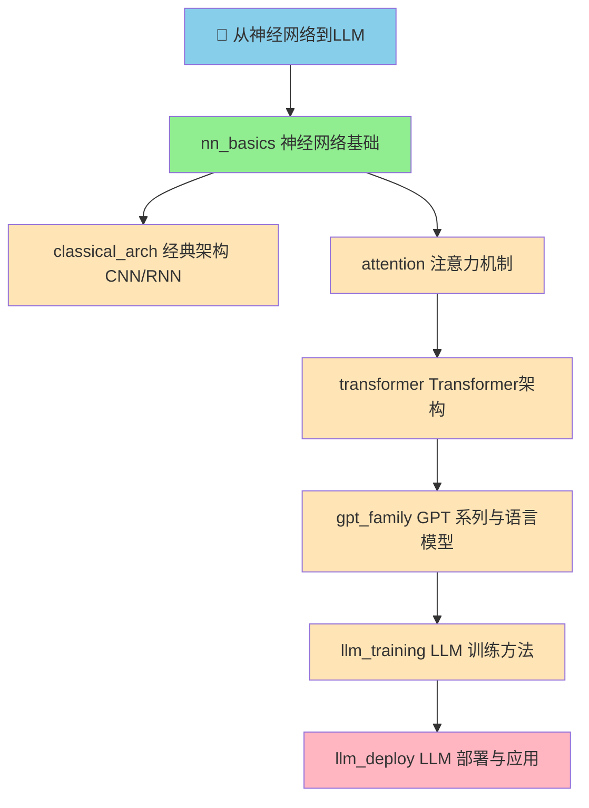

# 项目宪法：completion_guide.md

> ⚠️ 本文档为项目宪法框架，结构锁定，内容经用户授权后可演进。
> 目标：从神经网络基础到大型语言模型的完整学习路径

---

## 一、项目信息

| 字段 | 内容 |
|------|------|
| **Global Goal** | 从神经网络到LLM |
| **项目 slug** | 从神经网络到llm |
| **创建日期** | 2026-04-03 |
| **版本** | v1.0 |

---

## 二、学习路径（DAG 拓扑）



---

## 三、节点 Pre-condition 分数线

| 节点 | 前置节点最低分 | 说明 |
|------|--------------|------|
| nn_basics | 0 | 根节点，无前置 |
| classical_arch | 70 | nn_basics 达标后可开始 |
| attention | 70 | nn_basics 达标后可开始 |
| transformer | 70 | attention 达标后可开始 |
| gpt_family | 70 | transformer 达标后可开始 |
| llm_training | 70 | gpt_family 达标后可开始 |
| llm_deploy | 70 | llm_training 达标后可开始 |

---

## 四、节点详情

### 1. nn_basics — 神经网络基础

**主题**：MLP、激活函数、损失函数、反向传播、梯度下降

**核心概念**：
- 感知器与多层感知器 (MLP)
- 激活函数：Sigmoid, ReLU, Tanh, Softmax
- 损失函数：MSE, Cross-Entropy
- 反向传播算法与梯度下降
- 过拟合与正则化

**引经据典**：
- Rumelhart et al. — Learning Representations by Back-propagating Errors (1986)
- Goodfellow et al. — Deep Learning (2016) Chapter 6

---

### 2. classical_arch — 经典架构 CNN/RNN

**主题**：卷积神经网络、循环神经网络、LSTM、GRU

**核心概念**：
- CNN：卷积层、池化层、LeNet/AlexNet/VGG
- RNN：时序建模、BPTT
- LSTM：门控机制、记忆单元
- GRU：简化门控

**引经据典**：
- LeCun et al. — Gradient-Based Learning Applied to Document Recognition (1998)
- Hochreiter & Schmidhuber — Long Short-Term Memory (1997)

---

### 3. attention — 注意力机制

**主题**：Seq2Seq、Attention mechanism、Self-Attention

**核心概念**：
- Seq2Seq 架构
- Bahdanau Attention
- Self-Attention 计算流程
- Scaled Dot-Product Attention

**引经据典**：
- Bahdanau et al. — Neural Machine Translation by Jointly Learning to Align and Translate (2014)
- Vaswani et al. — Attention Is All You Need (2017) Section 3.2

---

### 4. transformer — Transformer 架构

**主题**：Positional Encoding、Encoder-Decoder、Multi-Head Attention

**核心概念**：
- Positional Encoding：正弦/余弦编码
- Encoder-Decoder 结构
- Multi-Head Attention
- Layer Normalization & Residuals

**引经据典**：
- Vaswani et al. — Attention Is All You Need (2017)

---

### 5. gpt_family — GPT 系列与语言模型

**主题**：GPT-1/2/3/4、LLaMA、ChatGPT 演进

**核心概念**：
- GPT-1：Generative Pre-training
- GPT-2：Zero-shot Task Transfer
- GPT-3：In-context Learning
- LLaMA：Open-source Foundation
- ChatGPT 的演进

**引经据典**：
- Radford et al. — Improving Language Understanding by Generative Pre-Training (2018)
- Brown et al. — Language Models are Few-Shot Learners (GPT-3, 2020)

---

### 6. llm_training — LLM 训练方法

**主题**：预训练、SFT、RLHF、DPO、Alignment

**核心概念**：
- 预训练：Next Token Prediction
- SFT：Supervised Fine-Tuning
- RLHF：Reward Model + PPO
- DPO：Direct Preference Optimization
- Constitutional AI

**引经据典**：
- Ouyang et al. — Training language models to follow instructions with human feedback (InstructGPT, 2022)
- Rafailov et al. — Direct Preference Optimization (DPO, 2023)

---

### 7. llm_deploy — LLM 部署与应用

**主题**：Quantization、推理优化、RAG、Agent

**核心概念**：
- 量化：INT8/INT4、GPTQ、AWQ
- 推理优化：KV Cache、Batching、Speculative Decoding
- RAG：Retrieval-Augmented Generation
- Agent：Tool Use、Planning、Memory

**引经据典**：
- Lewis et al. — Retrieval-Augmented Generation for Knowledge-Intensive NLP Tasks (2020)
- Schick et al. — Toolformer (2023)

---

## 五、频率控制策略

| 节点 | 当前频率 | 评分趋势 | 下次频率 |
|------|---------|---------|---------|
| 全部 | 15min | — | 随评分动态调整 |

---

## 六、维护到 GitHub 仓库

### 6.1 仓库信息

| 字段 | 内容 |
|------|------|
| **仓库地址** | `git@github.com:Dong1C/NN2LLM.git` |
| **分支** | `main` |
| **本地路径** | `/home/doc/.openclaw/workspace/从神经网络到llm/` |

### 6.2 同步规范

```
每次节点完成度更新后（score 变化），执行一次 commit：

节点完成/更新：
  git add <节点内容>
  git commit -m "[feat]: <节点ID> 完成度 <旧分数>→<新分数>"

宪法/拓扑变更：
  git add completion_guide.md .orchestrator/dag.json
  git commit -m "[docs]: 更新宪法或 DAG"

提交规范：
  [feat]: 新节点内容创建或重大更新
  [fix]: 问题修复
  [docs]: 宪法/指南/拓扑变更
  [refactor]: 重构（不影响功能）
```

### 6.3 推送规则

- 仅在节点评分达标（≥70）或重要文档变更后推送
- 推送前确认无敏感信息
- 推送后记录于 sync log

---

## 七、宪法变更日志

| 版本 | 日期 | 变更内容 | 授权人 |
|------|------|---------|--------|
| v1.0 | 2026-04-03 | 初始建立：7节点 DAG 拓扑 | retr0 |
| v1.1 | 2026-04-03 | 新增 GitHub 仓库维护规范（第六节）| retr0 |
